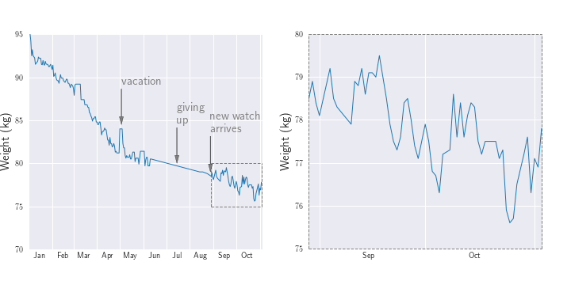
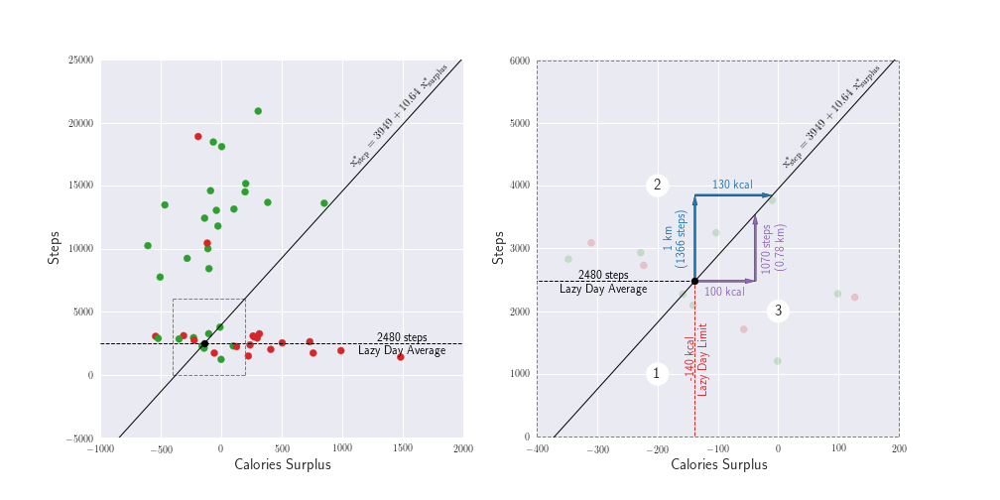

# Analyze my weight loss journey using machine learning

This is the project of analyzing my weight loss journey during 2018. The 2 main goals for this project are:
1. Build a machine learning model (namely regularized logistic regression) to classify whether I would gain weight
or lose weight on a given day given how many calories I eat beyond my budget and my step count for that day. 
The parameters of the model (the regression coefficients and the decision boundary) are also used to give simple, 
actionable numbers that I could use for my weight loss journey.

2. Build this machine learning model from scratch without using 3rd-party libraries (aside from numpy and pandas).
This includes the model algorithm (batch gradient ascent), k-fold cross validation, performance metrics, ROC curve, 
and other related visualizations. This turned out to be not as intimidating as I'd thought.
In fact, the core algorithm for batch gradient ascent can be done in 3 lines of code!

You can read about the result of this project in my writeup on [Medium](https://link.medium.com/9KJRGuzsqU). 
All codes are contained in the Juypter notebook ([analysis.ipynb](analysis.ipynb)) in the root folder.
Input data are found in the [data](data) subfolder, and output visualizations in the [viz](viz) subfolder.

For any question or feedback, please don't hesitate to contact me on Medium!

